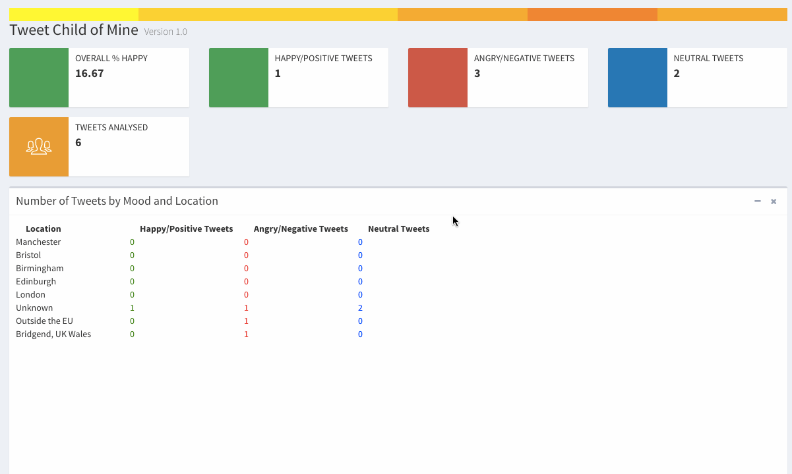
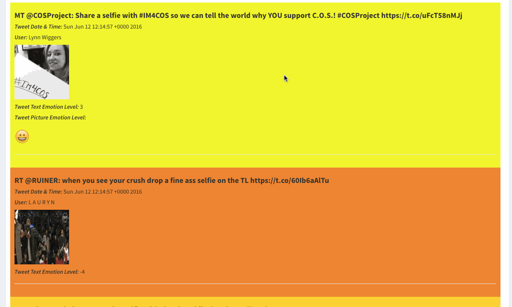

# tweetchildofmine
Visualise twitter, showing sentient context

##Hackathon Project. 
Project was part of a learning and team building exercise.
** Code quality not indicative of our day to day code, which is excellent. This is not!**

Takes in a search term and stream tweets back.

Analyse text for negative-positive sentient

Analyse images for overriding emotion

